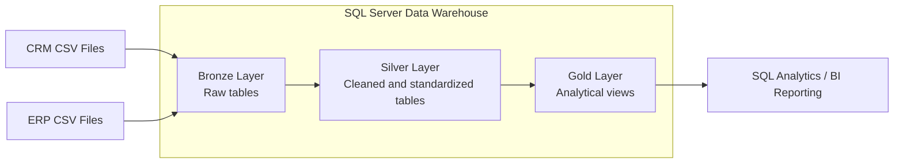
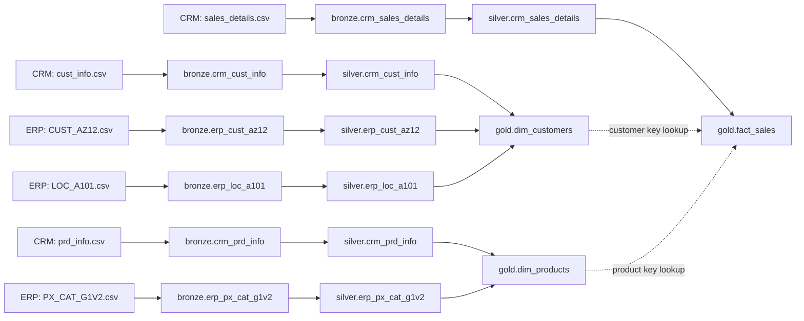
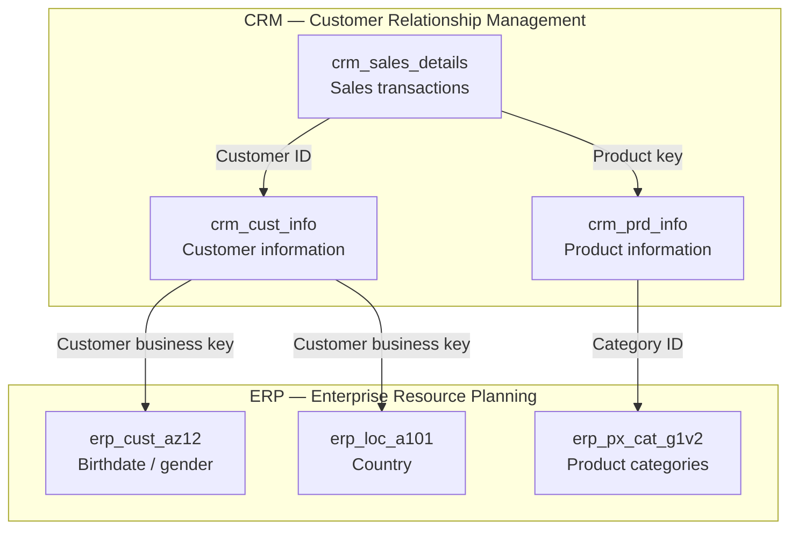
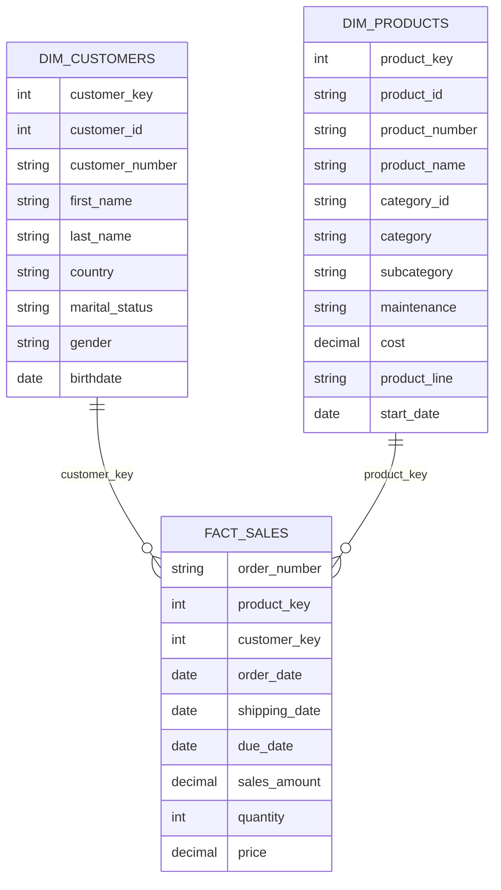
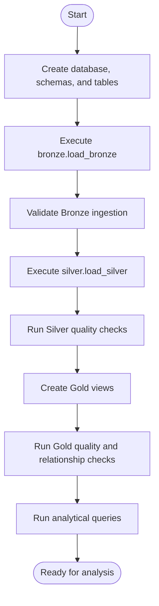
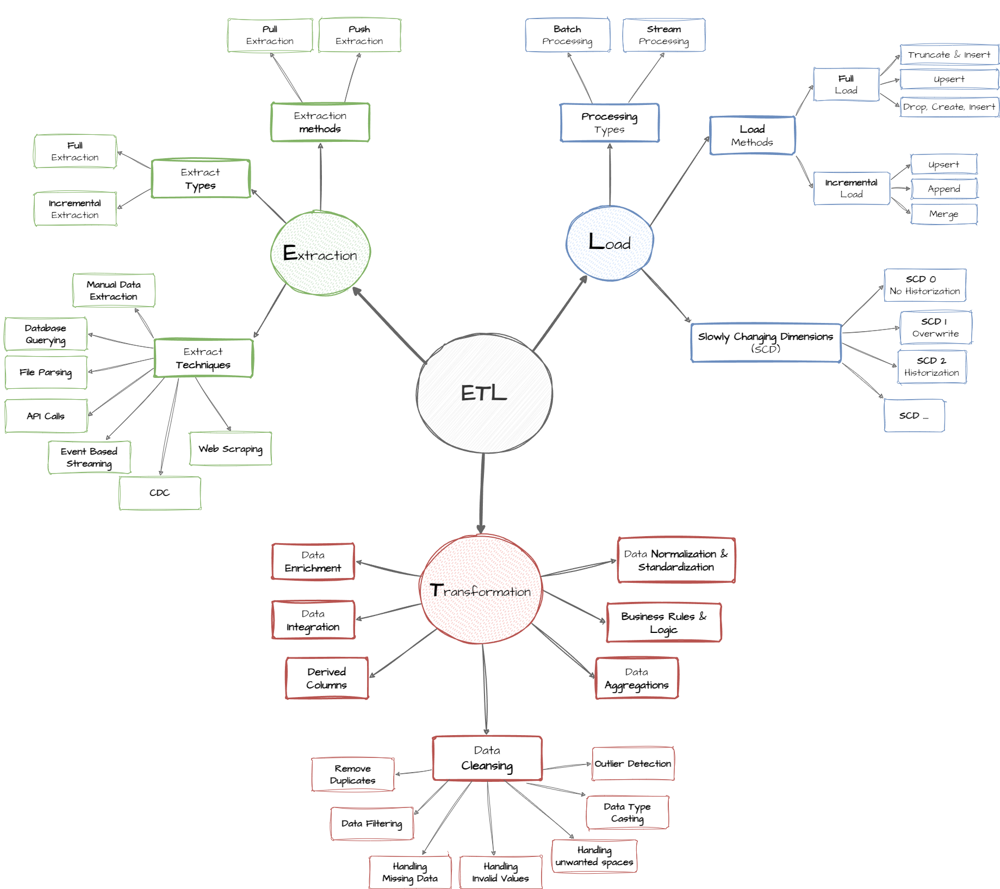

# SQL Data Warehouse Project

A SQL Server data warehouse portfolio project integrating CRM and ERP
sales data through a **Bronze--Silver--Gold Medallion Architecture**.
The project demonstrates CSV ingestion, T-SQL transformations, data
quality checks, dimensional modeling, and analytical queries.

## Table of Contents

-   [Overview](#overview)
-   [Architecture](#architecture)
-   [Data Flow and Lineage](#data-flow-and-lineage)
-   [Source Integration](#source-integration)
-   [Gold Data Model](#gold-data-model)
-   [ETL Workflow](#etl-workflow)
-   [Data Quality and Results](#data-quality-and-results)
-   [Analytics Use Cases](#analytics-use-cases)
-   [Technology Stack](#technology-stack)
-   [Repository Structure](#repository-structure)
-   [How to Run](#how-to-run)
-   [Design Decisions and
    Limitations](#design-decisions-and-limitations)
-   [Attribution](#attribution)
-   [Author](#author)

## Overview

The objective is to build a repeatable data warehouse using **Microsoft
SQL Server** and **T-SQL**. Data from CRM and ERP CSV files is ingested,
cleaned, standardized, integrated, and exposed through Gold-layer views
for analysis and reporting.

## Architecture



### Bronze Layer --- Raw Data

-   Stores source data as-is for traceability and debugging.
-   Loads CSV files using `BULK INSERT`.
-   Uses full refreshes with `TRUNCATE` and `INSERT`.
-   Orchestrated by `bronze.load_bronze`.

### Silver Layer --- Cleaned and Standardized Data

-   Stores transformed data in tables.
-   Uses full refreshes with `TRUNCATE` and `INSERT`.
-   Orchestrated by `silver.load_silver`.
-   Applies trimming, standardization, duplicate handling, date
    conversion, key cleanup, and business-rule-based corrections.
-   Integrates CRM and ERP attributes where appropriate.

### Gold Layer --- Business-Ready Data

The Gold layer exposes three views:

  -----------------------------------------------------------------------
  Object                              Purpose
  ----------------------------------- -----------------------------------
  `gold.dim_customers`                Customer information enriched with
                                      demographic and geographic
                                      attributes

  `gold.dim_products`                 Product details enriched with
                                      category information

  `gold.fact_sales`                   Sales transactions linked to
                                      customer and product dimensions
  -----------------------------------------------------------------------

The model follows a star-schema-style design. Gold objects are views;
surrogate keys generated with `ROW_NUMBER()` are calculated at query
time rather than stored persistently.

## Data Flow and Lineage



## Source Integration

Six CSV files are used from two source systems.

  Source   File                  Bronze / Silver entity
  -------- --------------------- ------------------------
  CRM      `cust_info.csv`       `crm_cust_info`
  CRM      `prd_info.csv`        `crm_prd_info`
  CRM      `sales_details.csv`   `crm_sales_details`
  ERP      `CUST_AZ12.csv`       `erp_cust_az12`
  ERP      `LOC_A101.csv`        `erp_loc_a101`
  ERP      `PX_CAT_G1V2.csv`     `erp_px_cat_g1v2`

CRM provides customer, product, and sales information. ERP enriches
customer records with birthdate and location attributes and provides
product category information.



## Gold Data Model



-   **`gold.dim_customers`:** combines CRM customer information with ERP
    customer and location attributes.
-   **`gold.dim_products`:** combines CRM product information with ERP
    category data and selects current product records according to the
    project logic.
-   **`gold.fact_sales`:** links sales transactions to customer and
    product dimensions.

## ETL Workflow




### ETL Methods Reference Diagram

The following reference diagram summarizes extraction, transformation, and loading methods relevant to the project.



### Transformation summary

1.  Load the six CSV files into Bronze tables.
2.  Clean and standardize customer names, marital status, gender,
    identifiers, and country values.
3.  Handle duplicate customer records.
4.  Derive product category and product keys and calculate product
    validity end dates with `LEAD()`.
5.  Convert sales date values and apply the project's sales and price
    correction rules.
6.  Combine CRM and ERP data in Gold dimensions.
7.  Connect sales transactions to customer and product dimensions.
8.  Run quality checks and analytical queries.

## Data Quality and Results

Quality checks cover: - Duplicate or null customer identifiers. -
Unwanted spaces and unexpected categorical values. - Null or invalid
product costs. - Invalid product date ranges. - Invalid sales dates and
date ordering. - Sales, quantity, and price consistency. - Invalid or
future customer birthdates. - Duplicate dimension surrogate keys. -
Missing fact-to-dimension matches.

The quality-check queries run during development returned no rows for
the error conditions tested. This indicates those specific checks passed
for the tested data, but does not guarantee every possible issue has
been ruled out.

Silver row counts recorded during development:

  Silver table                     Rows
  ---------------------------- --------
  `silver.crm_cust_info`         18,484
  `silver.crm_prd_info`             397
  `silver.crm_sales_details`     60,398
  `silver.erp_loc_a101`          18,484
  `silver.erp_cust_az12`         18,483
  `silver.erp_px_cat_g1v2`           37

Counts represent the dataset at the time of validation and may change if
the source files change.

## Analytics Use Cases

The Gold views support analysis such as: - Monthly sales and order
trends. - Top products by revenue and units sold. - Revenue by
country. - Distinct order and customer counts.

Analytical query examples include monthly sales trends, top products by
revenue, and revenue by country.

## Technology Stack

-   **Database:** Microsoft SQL Server
-   **Query language:** T-SQL
-   **IDE:** SQL Server Management Studio (SSMS)
-   **Ingestion:** `BULK INSERT`
-   **ETL:** Stored procedures
-   **Architecture:** Medallion (Bronze, Silver, Gold)
-   **Modeling:** Star-schema-style fact and dimension views
-   **Version control:** Git and GitHub
-   **Diagrams:** supplied architecture, data flow, integration, data model, and ETL diagrams (PNG/Draw.io)

## Repository Structure

``` text
sql-data-warehouse-project/
├── datasets/
│   ├── source_crm/
│   └── source_erp/
├── docs/
│   ├── data_architecture.drawio
│   ├── data_flow.drawio
│   ├── data_integration.drawio
│   ├── data_models.drawio
│   ├── data_catalog.md
│   └── naming_conventions.md
├── scripts/
│   ├── bronze/
│   ├── silver/
│   └── gold/
├── tests/
│   ├── quality_checks_silver.sql
│   └── quality_checks_gold.sql
├── README.md
├── LICENSE
└── .gitignore
```

Adjust the example tree to match the actual files and folders in your
repository.

## How to Run

1.  Install SQL Server and SQL Server Management Studio.
2.  Clone or download this repository.
3.  Place the CSV files in the expected CRM and ERP folders.
4.  Update file paths in the Bronze ingestion procedure and ensure the
    SQL Server service account can access them.
5.  Execute database, schema, and table setup scripts.
6.  Run `bronze.load_bronze`.
7.  Run `silver.load_silver`.
8.  Create the Gold views.
9.  Run Silver and Gold quality-check scripts.
10. Run analytical queries against the Gold views.

Execute scripts in dependency order. Review scripts that drop and
recreate objects before running them.

## Design Decisions and Limitations

-   Bronze and Silver use full refreshes rather than incremental
    loading.
-   Historical changes are not tracked; the intended scope is the latest
    available dataset.
-   Gold objects are views rather than physically materialized fact and
    dimension tables.
-   `ROW_NUMBER()` surrogate keys are query-time values and may change
    if source data or ordering changes.
-   Production systems may require persistent surrogate keys,
    incremental loading, orchestration, monitoring, security controls,
    and broader automated testing.

## Attribution

This is a hands-on learning and portfolio project inspired by the SQL
Data Warehouse Project by **Data With Baraa**. Where code or other
materials are reused, preserve applicable copyright notices and license
terms. Dataset and third-party asset licensing may be separate from the
software license.

## Author

**Yash Izate**

SQL Server \| T-SQL \| Data Warehousing \| ETL \| Data Quality \|
Dimensional Modeling
